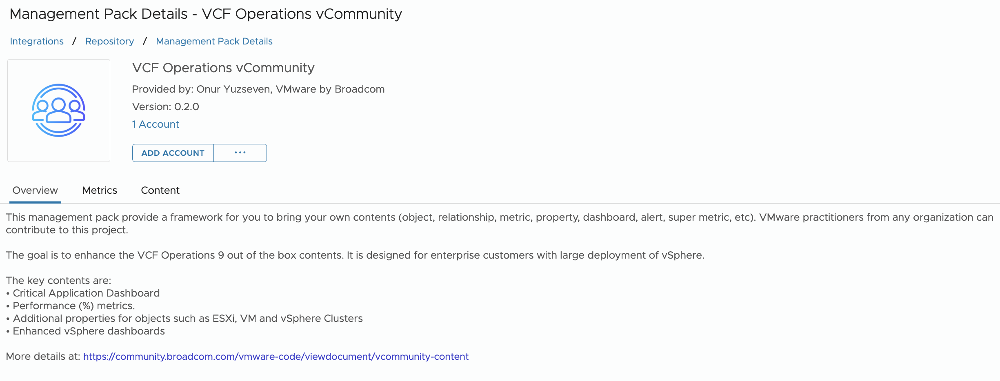

)

)
)
)

# VCF Operations vCommunity

This Management Pack gives the user the ability to add your own content to VCF Operations. While the Management Pack Builder is an option for targets with REST APIs, the vCommunity Management Pack was built using the Integration SDK and offers more advanced features. 

With Phyton programming and VCF Operations API knowledge, you can:

* Add your own Metrics and Properties for existing VCF Objects. 
* Create your own Object Types.
* Add your own Alerts, Dashboards, and Reports. To override existing ones, simply use the same ID.
* Add your own Super Metrics. Note you need to enable them manually in the Policy UI.

### Dashboards
New Dashboards:
* Critical Business Application 
* vSphere Resource Management 
* VM Storage Configuration 

Enhanced Dashboards:
* VM Configuration
* VM Capacity
* VM Performance
* vSphere Cluster Performance
* vSphere Cluster Capacity
* vSphere Cluster Configuration
* ESXi Configuration
* vSphere Network Configuration

### Reports
Reports were designed to replace all the existing Reports that came out-of-the-box.
There are 2 types of reports: PDF and CSV.

### Additional Properties & Metrics
- Cluster HA/DRS/EVC
- ESXi Host System Advanced System Settings
- ESXi Host Software Packages
- Virtual Machine Advanced Parameters
- Virtual Machine Options
- Virtual Machine Age
- Virtual Machine Snapshot Count

### Windows Service Monitoring:
* Windows Service Monitoring to track the status of critical services (currently we monitor all Windows Services set to Automatic

### Windows Event Log Monitoring:
* Windows Event Log Monitoring 
