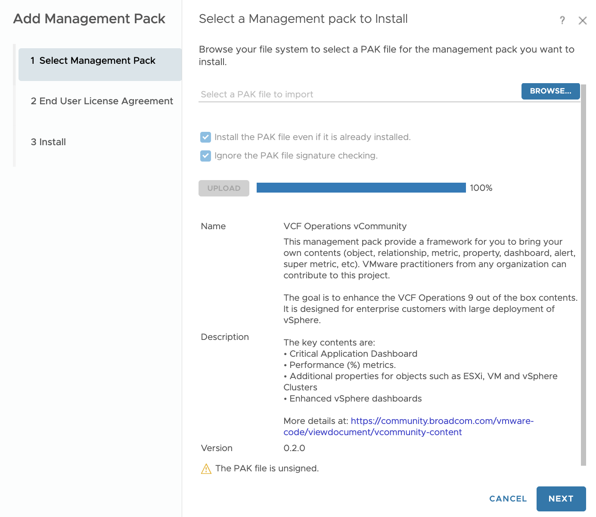
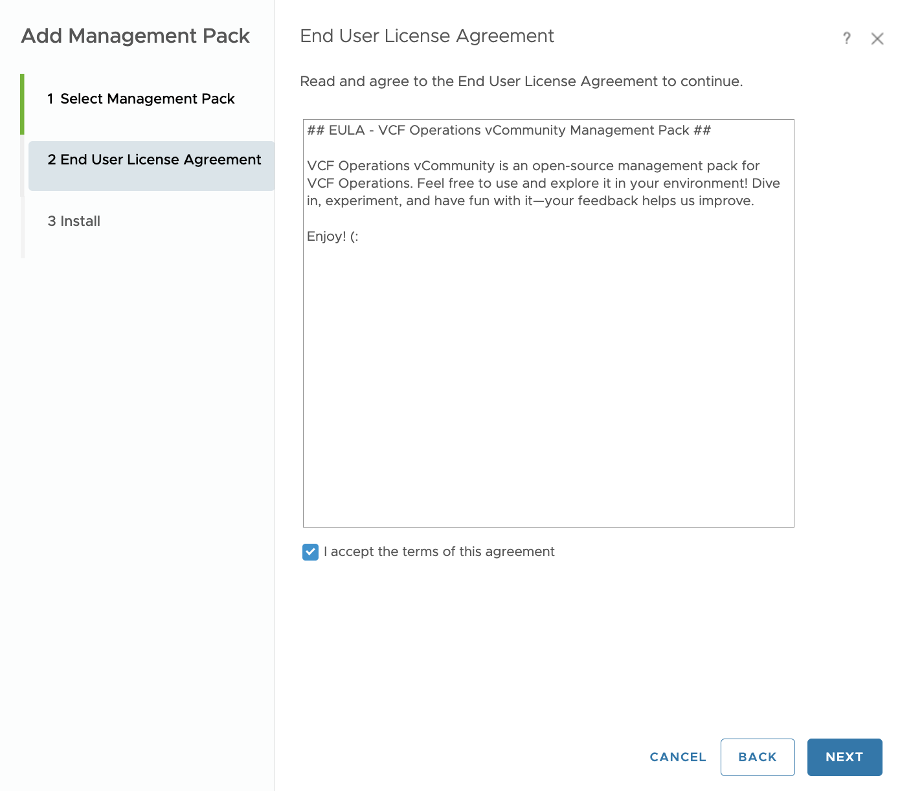
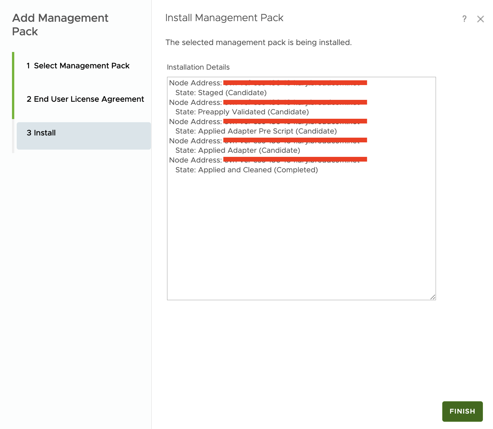
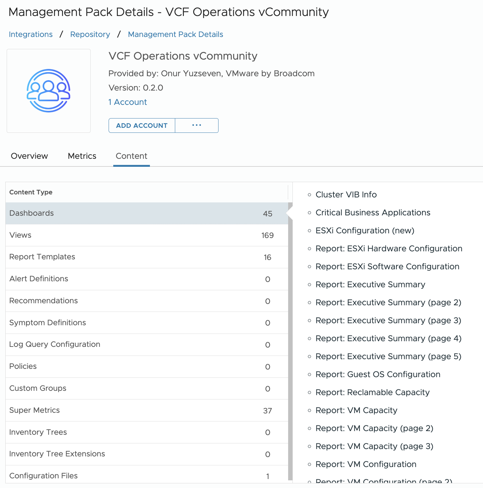

## Enable Unsigned Adapter
Since the PAK file is not signed by VMware you need to enable "*Allow unsigned PAK installation*" feature from the https://VCF_Ops/admin UI Administrator Settings > Security Settings > ACTIVATE UNSIGNED PAK INSTALLATION

After enabling that feature you will see the "*Ignore the PAK file signature checking.*" checkbox available on PAK installation wizard.

One this has been done you can install the Management Pack.

*  Navigate Administration > Integrations > Repository Tab and click Add in VCF Operations 

* Browse the `VCFOperationsvCommunity_x.x.x.pak` file and select "Install the PAK file even if it is already installed." to override the installation and select "Ignore the PAK file signature checking." since VCF Operations vCommunity MP is unsinged to allow VCF Operations install the .pak file. Lastly, upload the file and click Next.

* Accept the End User License Agreement to continue and click Next.

* Once PAK file installation is completed click FINISH.

* You can review the VCF Operations vCommunity Management Pack under the Repository Tab.

