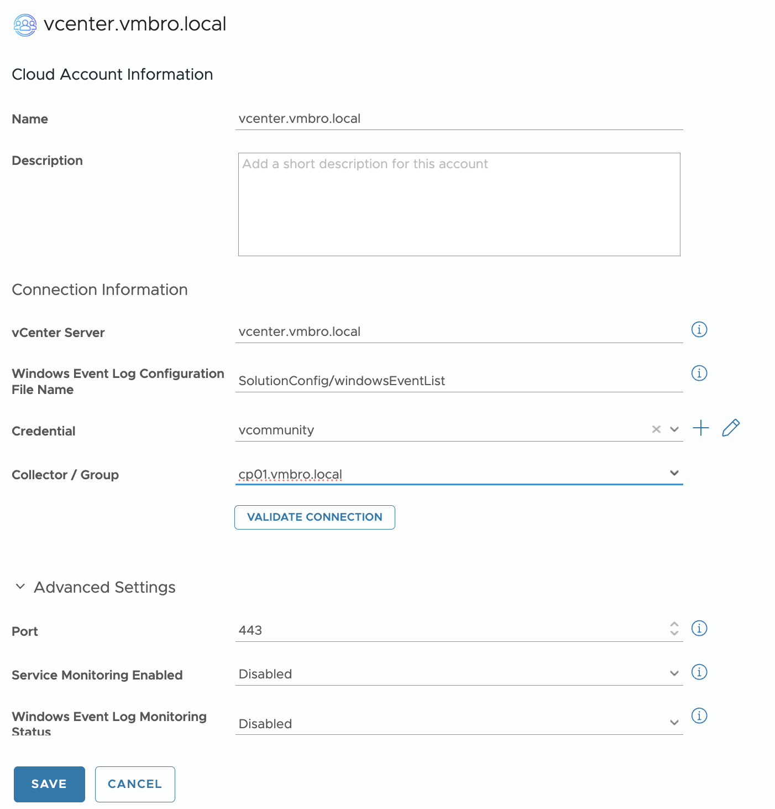

## Configuration and Integration
Once the vCommunity Management Pack has been installed, you will create an Adapter Instance for your vCenter/s.

https://github.com/vmbro/VCF-Operations-vCommunity/blob/main/Documentation-Images/screenshots/Configuration/Adapter_Instance_Configuration.png?raw=true

dd your vCenter FQDN and select a Cloud Proxy for the data collection. Other features are optional. If cloud proxy has container registry access then adapter should start data collection shortly.

