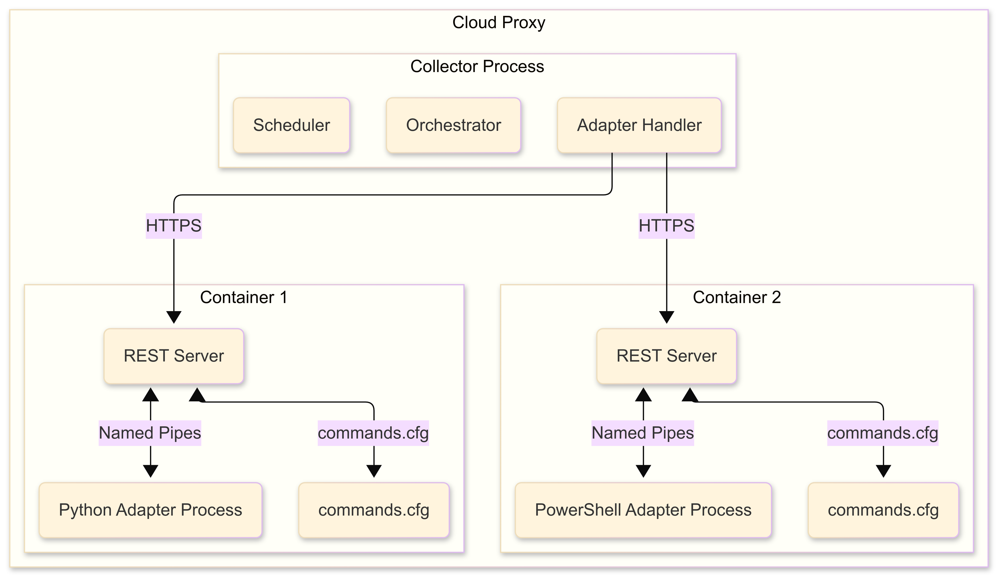

## How does VCF Operations vCommunity Management Pack Work ? 
Custom Management Packs that are created by VCF Operations Integration SDK require some additional requirements. MPs created by the Integration SDK need to run on only cloud proxy for the data collection. Once you installed the PAK file and created an integration with any account Cloud Proxy tries to access the adapter container registry to pull docker image configuration. After that docker image will install the necessary files that are defined in the DockerFile then the PAK file will be initialized for the data collection process.

If Cloud Proxy has container registry access users can simply install PAK files then create an integration. There will be no need for any other modifications by users in VCF Operations.



## How Integration SDK Works ?

A Cloud Proxy collector process managing adapter containers, which each correspond to one adapter instance. Within each container is the REST server and the adapter process. The ```Commands.cfg``` file tells the REST server how to run the adapter process for each endpoint.


