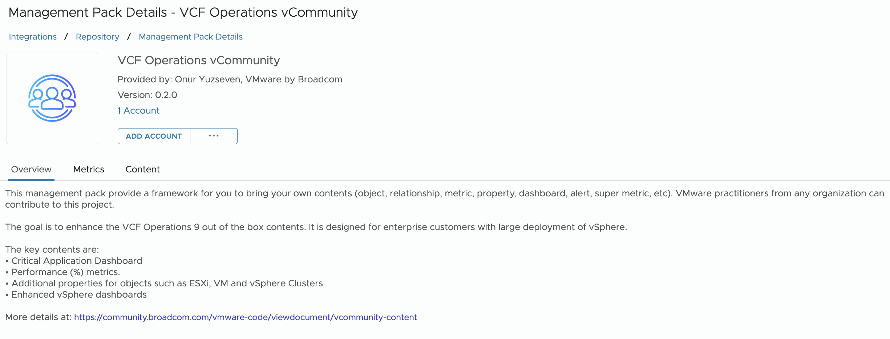

# VCF Operations vCommunity

This management pack lowers the knowledge barrier required to add your own content to VCF Operations. While the MP Builder is better for quick and simple addition, a native management pack empowers you to build more advanced features. 

With Phyton programming and VCF Operations API knowledge, you can:

* Add your own metrics and properties for the VCF Objects. They can have complex logic as it's all done in programming. Define them into the existing objects.
* Create your own object. You can define a new object type.
* Add your own alerts, dashboards, reports. To override existing ones, simply use the same ID
* Add your own super metric. Take note you need to enable them manually in the Policy UI.

### Dashboards
New dashboards:
* Critical Business Application 
* vSphere Resource Management 
* VM Storage Configuration 

Enhanced dashboards:
* VM Configuration
* VM Capacity
* VM Performance
* vSphere Cluster Performance
* vSphere Cluster Capacity
* vSphere Cluster Configuration
* ESXi Configuration
* vSphere Network Configuration

### Reports
The reports were designed as 1 integrated suite. Use them to replace all the existing vSphere adapter reports.
There are 2 types of reports
* PDF. These are per pillar of operations
* CSV. These are per object type, for export purpose.

### Additional Properties & Metrics
- Cluster HA/DRS/EVC
- Virtual Machine Advanced Parameters
- Virtual Machine Age
- Virtual Machine Snapshot Count
  
### Advanced Parameters
You can collect any settings of ESXi, VM and vSphere Clusters. 

### ESXi Software Packages
(VIB driver details)

### Windows Service Monitoring:
* Windows Service Monitoring to track the status of critical services

### Windows Event Log Monitoring:
* Windows Event Log Monitoring for proactive detection of system issues
