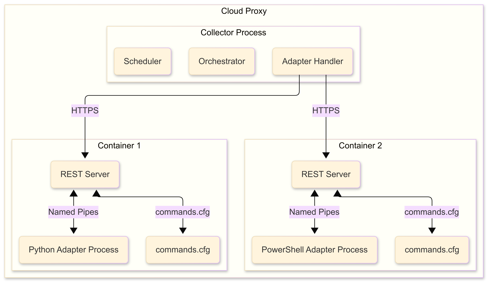
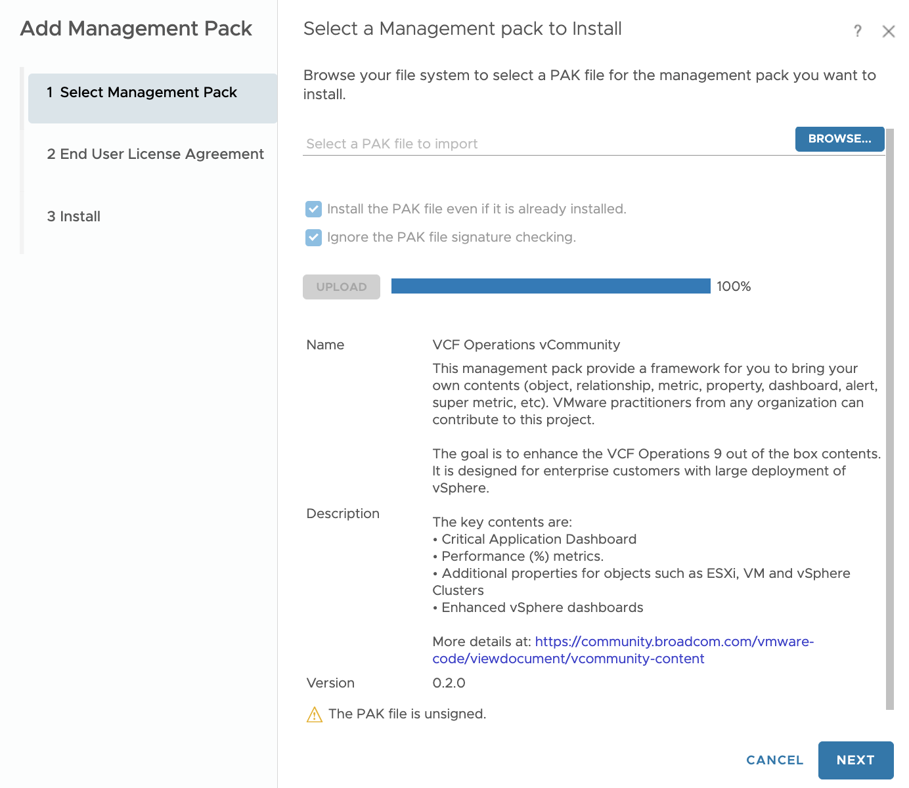
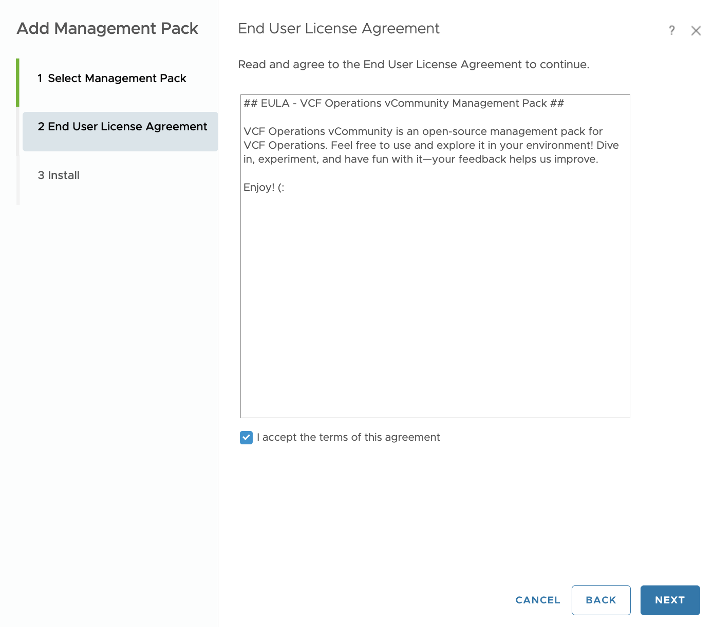
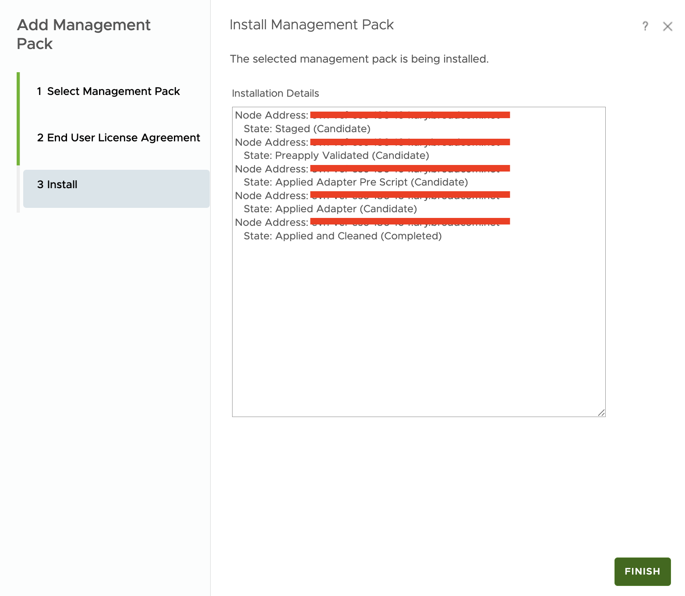
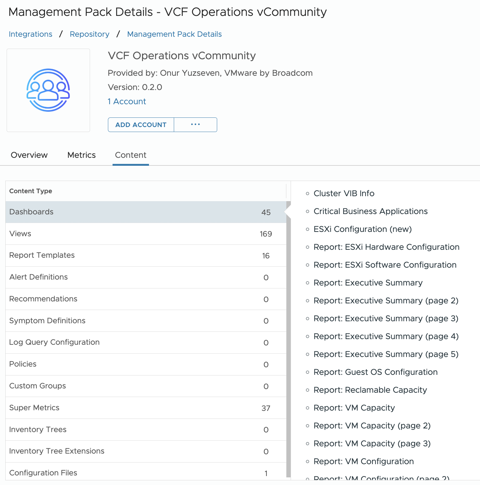
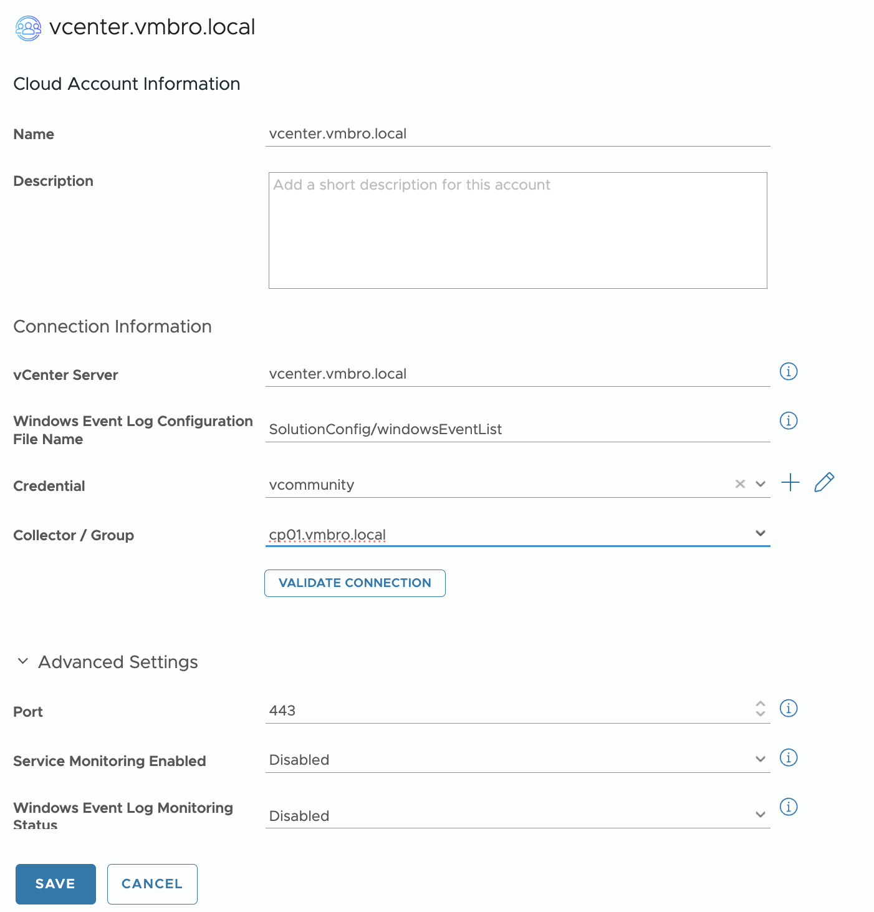

[]([https://github.com/vmbro/VCF-Operations-vCommunity-Content](https://github.com/vmbro/VCF-Operations-vCommunity-Content))
[](https://badge.fury.io/gh/vmbro%2Fvcf-operations-vcommunity-content)
[]([https://github.com/vmbro/VCF-Operations-vCommunity-Content](https://github.com/vmbro/VCF-Operations-vCommunity-Content))
[]([https://vmbro.com/](https://github.com/vmbro/VCF-Operations-vCommunity-Content))
[]([https://github.com/vmbro/VCF-Operations-vCommunity-Content/stargazers](https://github.com/vmbro/VCF-Operations-vCommunity-Content/stargazers))


# VCF Operations vCommunity

This management pack lowers the knowledge barrier required to add your own content to VCF Operations. While the MP Builder is better for quick and simple addition, a native management pack empowers you to build more powerful features. 

Also, with some programming and API knowledge, you can do the following:

* Add your own metrics and properties for the VCF Objects. They can have complex logic as it's all done in programming. Define them into the existing objects.
* Create your own object. You can define a new object type and
* Add your own alerts, dashboards, reports. To override existing ones, simply use the same ID
* Add your own super metric. 


## Table of Contents

[TBD](https://linktodocumentation)


## Description

This Management Pack extends the capabilities of VMware Aria Operations by delivering deeper visibility, smarter monitoring, and actionable insights for your infrastructure. It combines unique custom metrics with Windows-specific monitoring to help you ensure performance, availability, and reliability at scale.

With this pack, you will gain a ready-to-use yet customizable toolkit that bridges the gap between raw infrastructure data and meaningful operational intelligence.

### Key Features:

* Unique custom metrics & properties for extended visibility
* Windows Service Monitoring to track the status of critical services
* Windows Event Log Monitoring for proactive detection of system issues
* Advanced content: 44 dashboards, 169 views, 16 reports, and 37 super metrics for analytics and visualization

## System Requirements

### Platform Requirements
* Aria Operations 8.18.x and higher including VCF Operations 9.x
* vCenter Server 8 and higher including VCF 9.x
* Aria Operations Cloud Proxy
* Container Registry access to allow Cloud Proxy to install adapter requirements

Cloud Proxy will try to pull that container image from following example registry to set-up the adapter. This is by design of the VCF Operations Integration SDK.
```
ghcr.io/vmbro/vcf-operations-vcommunity:x.x.x_x.x
```

### User Account Requirements
#### vCenter Server:
* An account with read-only permission
* Propagate to children option must be selected
* ```Host.Configuration.ImageConfiguration``` (Need for collecting ESXi VIB packages)

#### Windows Service Monitoring:
*TBD*

#### Windows Event Log Monitoring:
*TBD*

## How does VCF Operations vCommunity Management Pack Work ? 
Custom Management Packs that are created by VCF Operations Integration SDK require some additional requirements. MPs created by the Integration SDK need to run on only cloud proxy for the data collection. Once you installed the PAK file and created an integration with any account Cloud Proxy tries to access the adapter container registry to pull docker image configuration. After that docker image will install the necessary files that are defined in the DockerFile then the PAK file will be initialized for the data collection process.

If Cloud Proxy has container registry access users can simply install PAK files then create an integration. There will be no need for any other modifications by users in VCF Operations.



## How Integration SDK Works ?

A Cloud Proxy collector process managing adapter containers, which each correspond to one adapter instance. Within each container is the REST server and the adapter process. The ```Commands.cfg``` file tells the REST server how to run the adapter process for each endpoint.



## Installation
*  Navigate Administration > Integrations > Repository Tab and click Add in VCF Operations 

* Browse the `VCFOperationsvCommunity_x.x.x.pak` file and select "Install the PAK file even if it is already installed." to override the installation and select "Ignore the PAK file signature checking." since VCF Operations vCommunity MP is unsinged to allow VCF Operations install the .pak file. Lastly, upload the file and click Next.



* Accept the End User License Agreement to continue and click Next.



* Once PAK file installation is completed click FINISH.



* You can review the VCF Operations vCommunity Management Pack under the Repository Tab.



## Integration
You can simply add your vCenter that you want to extend custom metrics and contents, add your vCenter FQDN and select a Cloud Proxy for the data collection. Other features are optional and left for user choice. If cloud proxy has container registry access then adapter should start data collection shortly.



## Contributing

*TBD*


## Support

Submit an issue or contact me via [LinkedIn](https://www.linkedin.com/in/oyuzseven/)


## License

[Attribution-NonCommercial 4.0 International (CC BY-NC 4.0)](https://creativecommons.org/licenses/by-nc/4.0/)


[](https://creativecommons.org/licenses/by-nc/4.0/)
