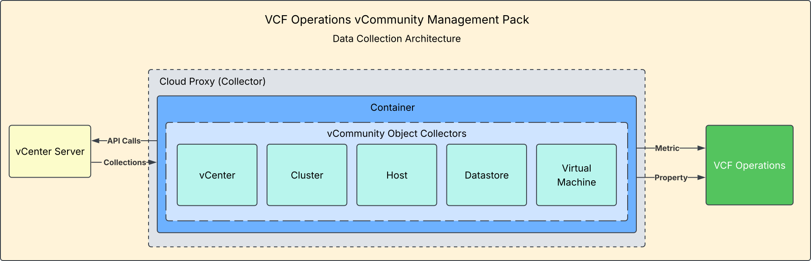
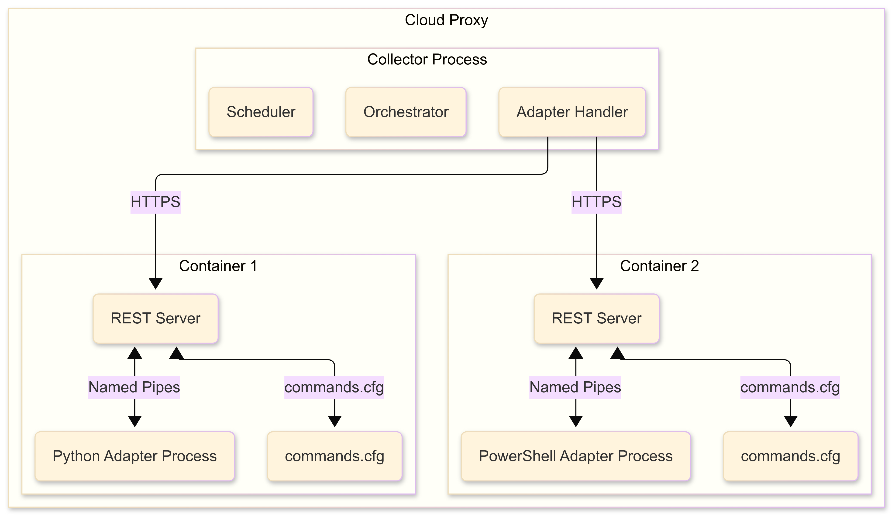

# How It Works

**On this page:**

- [How the vCommunity Management Pack Works](#how-the-vcommunity-management-pack-works)
- [How the Integration SDK Works](#how-the-integration-sdk-works)

---

## How the vCommunity Management Pack Works

Custom Management Packs created using the VCF Operations Integration SDK have some additional requirements. First, their Adapter Instances need to run on a **Cloud Proxy** for data collection.

Once you've installed the Management Pack and created an Adapter Instance, the Cloud Proxy pulls the adapter's Docker image from the container registry. That image installs the files defined in its `Dockerfile`, and the PAK file is then initialized to begin the data collection process.

If the Cloud Proxy has container registry access (i.e. access to the Internet), users can simply install the Management Pack and create Adapter Instances — no further modification is needed in VCF Operations.

> If your Cloud Proxy does **not** have internet/registry access, see [Dark Site Installation](dark-site.md) instead.

---

## How the Integration SDK Works

A Cloud Proxy runs a collector process that manages adapter containers, one per Adapter Instance. Within each container is a REST server and the adapter process itself. The `Commands.cfg` file tells the REST server how to run the adapter process for each endpoint (`test`, `collect`, `adapter_definition`, etc.).

---

**Next:** [Metrics & Properties Reference](metrics-reference.md) · [Configuration](configuration.md)
